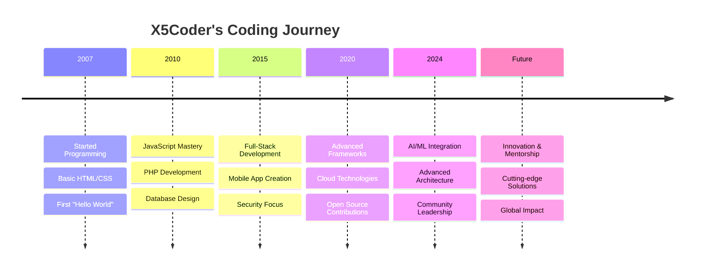

html
<div align="center">🌟Welcome to My Account X5Coder🌟</div>

<div align="center">
  
</div>

<div align="center">
  
</div>


---

<div align="center">
  
  
  [](https://github.com/X5Coder)
  [](https://github.com/X5Coder)

</div>


## 🔬 X5Coder.exe - System Analysis

```bash
┌─[X5Coder@shadow-dev]─[~]
└──╼ $ cat /etc/developer.conf

╔══════════════════════════════════════════════════════════════════╗
║                      🎯 SYSTEM SPECIFICATIONS                                                ║
╠══════════════════════════════════════════════════════════════════╣
║  👤 Developer: X5Coder                                                                      ║
║  📍 Location: Cairo 🇪🇬.                                                                          ║
║  🧠 Specialization: Prompt Engineering                                                          ║
║  🎂 Active Since: 没关系                                                                          ║
║  ⚡ Status: Always Learning & Building                                                           ║
║  🔥 Mission: Creating Digital Solutions That Matter                                               ║
╚══════════════════════════════════════════════════════════════════╝

class Developer {
    constructor() {
        this.name = "X5Coder";
        this.role = "Shadow Developer";
        this.languages = ["Arabic", "English"];
        this.currentFocus = "Building the future, one line at a time";
        this.lifePhilosophy = "Code with passion, debug with patience";
    }

    get skills() {
        return {
            programming: ["JavaScript", "Python", "PHP", "C++", "Java"],
            frontend: ["React", "Vue.js", "Angular", "Svelte", "TypeScript"],
            backend: ["Node.js", "Express", "Django", "FastAPI", "Laravel"],
            mobile: ["React Native", "Flutter", "Ionic"],
            database: ["MongoDB", "MySQL", "PostgreSQL", "Redis", "Firebase"],
            cloud: ["AWS", "Azure", "Google Cloud", "Heroku", "Netlify"],
            security: ["Ethical Hacking", "Penetration Testing", "Security Audits"],
            tools: ["Docker", "Kubernetes", "Jenkins", "Git", "Linux"]
        };
    }

    getCurrentStatus() {
        return {
            learning: "Advanced AI & Machine Learning",
            building: "Next-gen web applications",
            reading: "Clean Architecture patterns",
            listening: "Tech podcasts & cybersecurity news"
        };
    }
}

const developer = new Developer();
console.log(developer.getCurrentStatus());
```


📊 GitHub Analytics & Performance Metrics

<div align="center">
  
  
</div>

<div align="center">
  
</div>

<div align="center">
  
</div>

🏆 Achievement Vault

<div align="center">
  
</div>

🛠️ Technical Arsenal & Weaponry

<div align="center">

🔥 Core Technologies


🎨 Frontend Mastery


⚙️ Backend Engineering


📱 Mobile Development


🗄️ Database Systems


☁️ Cloud & DevOps


🔒 Security & Tools


</div>

📈 Real-time Coding Stats

<div align="center">
  
</div>

🌐 Digital Presence & Community

<div align="center">

📱 Social Networks & Channels

<a href="https://t.me/KIMO_VIP">
  
</a>

<a href="https://www.youtube.com/@Shadow-Dev-2007">
  
</a>

<a href="https://t.me/Shadow_Dev_2007">
  
</a>

<a href="https://whatsapp.com/channel/0029Vb6cg1yJuyAM4wI0SQ0T">
  
</a>

🌍 Professional Hub

<a href="https://X5Code.github.io/rdp-vnc/">
  
</a>

</div>

🎯 Current Mission & Objectives

<div align="center">

```python
  class CurrentMission:
      def __init__(self):
          self.status = "🔥 ACTIVE"
          self.projects = {
              "learning": ["AI/ML Engineering", "Cloud Architecture", "Advanced Security"],
              "building": ["Next-gen Web Apps", "Mobile Solutions", "API Services"],
              "exploring": ["Web3 Technologies", "IoT Systems", "Quantum Computing"],
              "sharing": ["Technical Tutorials", "Open Source Tools", "Community Content"]
          }
          
      def get_next_goals(self):
          return [
              "🚀 Launch innovative SaaS platforms",
              "🔒 Develop advanced security tools", 
              "📱 Create cross-platform mobile apps",
              "🌐 Build scalable cloud solutions",
              "🎓 Mentor upcoming developers"
          ]
  
  mission = CurrentMission()
  print(f"Status: {mission.status}")
```

</div>

🧠 Knowledge Base & Expertise

<div align="center">

💻 Development 🔒 Security ☁️ Cloud 📱 Mobile
Full-Stack Web Apps Ethical Hacking AWS Solutions React Native
API Development Penetration Testing Docker/K8s Flutter Apps
Database Design Security Audits CI/CD Pipelines iOS Development
System Architecture Vulnerability Assessment Microservices Android Development

</div>

💭 Developer Philosophy

<div align="center">
  
</div>

🔮 Interactive Elements

<details>
<summary>🎮 <b>Click to reveal my coding journey timeline</b></summary>



</details>

<details>
<summary>🚀 <b>Current Learning Path & Future Goals</b></summary>

🎯 2024-2025 Roadmap

· Q4 2024:
  · ✅ Master Advanced React Patterns
  · 🔄 Deep Dive into Microservices
  · 📋 Cloud Security Specialization
· Q1 2025:
  · 📋 AI/ML Integration in Web Apps
  · 📋 Advanced DevOps Practices
  · 📋 Web3 & Blockchain Exploration
· Q2 2025:
  · 📋 Launch Personal SaaS Project
  · 📋 Contribute to Major OSS Projects
  · 📋 Start Tech YouTube Series

</details>

🐍 Contribution Snake

<div align="center">
  
</div>

🎊 Fun Facts & Easter Eggs

<div align="center">

🎵 Coding Soundtrack: Lofi Hip Hop & Synthwave
  ☕ Fuel of Choice: Strong Coffee & Green Tea
  🌙 Peak Hours: Night Owl Coder (10 PM - 3 AM)
  🎯 Debug Method: Rubber Duck Debugging Champion
  📚 Always Reading: Tech Blogs, Documentation & Sci-Fi

</div>

---

<div align="center">

💫 "In the world of programming, every problem has a solution, and every solution opens the door to new creativity"

Always ready to collaborate on innovative projects and new technical challenges 🚀

  

</div>

---

<div align="center">
  
</div>
